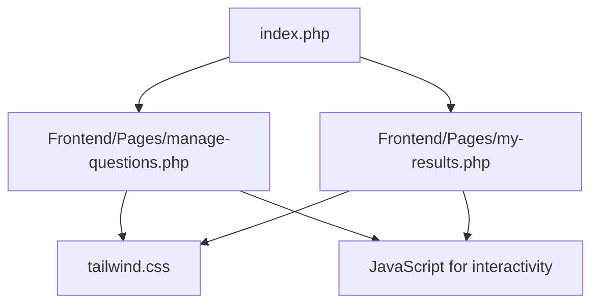
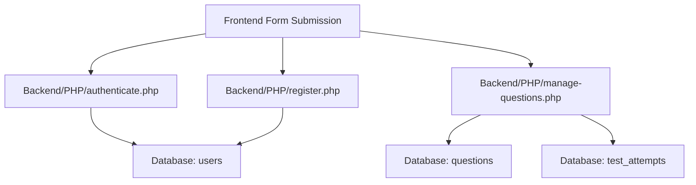

<div style="page-break-after: always;"></div>

# **CodeLens Project Documentation**

---

## **How to Use This Document**

- **For Viva:** Use bold headings and section summaries to quickly find answers. Review code snippets and diagrams before your exam.
- **For Reports:** Copy-paste into Word. Use Word’s heading styles for navigation. Replace Mermaid diagrams with screenshots if needed.
- **For Teachers/Examiners:** Each file and flow is explained in simple language with clear formatting.

---

## **Table of Contents**

1. **Project Overview**
2. **Tech Stack Used**
3. **Frontend**
   - **Structure & File Roles**
   - **HTML Tags & Tailwind CSS Classes (with explanations)**
   - **Animations & Effects (color, zoom, etc.)**
   - **JavaScript Usage & Logic**
   - **Mermaid Flow Diagram (Frontend)**
4. **Backend**
   - **Structure & File Roles**
   - **PHP Logic & Database Connection**
   - **Authentication Flow**
   - **Page-wise PHP Setup**
   - **Why .php is used**
   - **Mermaid Flow Diagram (Backend)**
5. **Database**
   - **Structure & Tables**
   - **Connection Details**
6. **FAQs & Viva Prep**
   - **Common Questions & Answers**

---

# **1. Project Overview**

**CodeLens** is a comprehensive, full-stack web application designed to streamline the process of conducting, managing, and analyzing coding-based assessments. The platform provides a seamless experience for both administrators and candidates, enabling the creation, delivery, and evaluation of online tests in a secure and user-friendly environment.

**Key Features:**

- **User Authentication & Roles:** Secure registration, login, and role-based access for admins and candidates.
- **Test Management:** Admins can create, edit, and delete coding/MCQ tests, assign questions, and monitor progress.
- **Question Bank:** Manage questions by category, difficulty, and automate scoring.
- **Test Taking:** Candidates can view and take tests in a timed environment, with support for both code and MCQ answers.
- **Analytics & Results:** Detailed dashboards for admins and instant results for candidates.
- **Modern UI/UX:** Responsive, visually appealing interface built with Tailwind CSS.
- **Security:** Uses PDO prepared statements, password hashing, and session-based authentication.

**Technologies Used:**

- **Frontend:** **HTML5**, **Tailwind CSS**, **JavaScript**
- **Backend:** **PHP 8+**, **MySQL**
- **Hosting:** **InfinityFree** (shared hosting)
- **Other Tools:** **phpMyAdmin** (for database management)

**Unique Aspects:**

- All test and question management is handled through a web interface.
- Real-time feedback and analytics.
- Easily extendable for future features.

---

## **2. Tech Stack Used**

- **Frontend:** **HTML5**, **Tailwind CSS**, **JavaScript**
- **Backend:** **PHP 8+**, **MySQL**
- **Hosting:** **InfinityFree** (shared hosting)
- **Other Tools:** **phpMyAdmin** (for database management)

---

## **3. Frontend**

### **Structure & File Roles**

| **File/Folder**               | **Role/Description**                                                     |
| ----------------------------- | ------------------------------------------------------------------------ |
| **index.php**                 | Entry point (homepage), redirects to `/Frontend/`                        |
| **Frontend/Pages/**           | Contains all main pages (e.g., `manage-questions.php`, `my-results.php`) |
| **Frontend/src/tailwind.css** | Compiled Tailwind CSS file used for all styling                          |
| **Frontend/src/input.css**    | Source CSS file for Tailwind CLI (not used directly in production)       |
| **Frontend/assets/**          | Images, icons, and other static assets                                   |
| **Frontend/js/**              | JavaScript files for interactivity                                       |
| Frontend/assets/              | Images, icons, and other static assets                                   |
| Frontend/js/                  | JavaScript files for interactivity                                       |

### HTML Tags & Tailwind CSS Classes

#### Example: `manage-questions.php`

- **HTML Tags Used:**

  - `<html>`, `<head>`, `<body>`, `<div>`, `<form>`, `<input>`, `<button>`, `<table>`, `<tr>`, `<td>`, `<th>`, etc.
  - Semantic tags for structure and accessibility.

- **Tailwind CSS Classes (with explanations):**
  - `bg-gradient-to-br from-amber-100 via-amber-200 to-amber-400`  
    _Creates a beautiful background gradient for the page._
  - `min-h-screen`  
    _Ensures the page takes at least the full height of the viewport._
  - `animate-fadein`  
    _Applies a custom fade-in animation when the page loads (defined in `<style>`)._
  - `flex`, `justify-center`, `items-center`  
    _Used for centering content horizontally and vertically._
  - `rounded-lg`, `shadow-lg`  
    _Gives elements rounded corners and a drop shadow for a modern look._
  - `hover:scale-105`, `transition-transform`, `duration-300`  
    _Creates a zoom effect on hover with smooth transition._
  - `text-xl`, `font-bold`, `text-gray-700`  
    _Controls text size, weight, and color for headings and labels._

**Every Tailwind class is used to make the UI modern, responsive, and visually appealing, while keeping the code concise.**

#### Animations & Effects

- **Color Animation:**  
  Achieved using Tailwind’s gradient utilities (`bg-gradient-to-br`, `from-*`, `to-*`).
- **Zoom Effect:**  
  Using `hover:scale-105` and `transition-transform` on cards or buttons.
- **Fade-in Animation:**  
  Custom CSS in `<style>`:
  ```css
  @keyframes fadein {
    0% {
      opacity: 0;
      transform: translateY(20px);
    }
    100% {
      opacity: 1;
      transform: translateY(0);
    }
  }
  .animate-fadein {
    animation: fadein 0.8s ease;
  }
  ```

#### JavaScript Usage

- **Where JS is Used:**

  - For interactive elements like modals, confirmation dialogs, dynamic content updates.
  - Example: Confirming deletion of a question, showing/hiding forms, fetching data via AJAX.

- **Why JS is Used:**
  - To enhance user experience without reloading the page.
  - To validate forms before submission.
  - To provide instant feedback and interactivity.

### Mermaid Flow Diagram (Frontend)



---

## 4. Backend

### Structure & File Roles

| File/Folder                      | Role/Description                                            |
| -------------------------------- | ----------------------------------------------------------- |
| Backend/PHP/config.php           | Handles database connection using PDO                       |
| Backend/PHP/database.sql         | SQL dump for creating all tables and inserting initial data |
| Backend/PHP/authenticate.php     | Handles user login/authentication logic                     |
| Backend/PHP/register.php         | Handles user registration logic                             |
| Backend/PHP/manage-questions.php | Backend logic for managing questions (CRUD operations)      |
| Backend/PHP/submit-test.php      | Handles test submissions and scoring                        |
| Backend/PHP/utils.php            | Utility functions used across the backend                   |

### PHP Logic & Database Connection

- **Database Connection:**  
  In `config.php`, uses PDO:

  ```php
  $pdo = new PDO("mysql:host=$host;dbname=$dbname", $username, $password);
  ```

  - Credentials are set for the InfinityFree MySQL database.
  - PDO provides a secure, flexible way to interact with MySQL.

- **Why .php for every file?**  
  PHP files allow embedding server-side logic, database queries, and dynamic content generation.  
  Each .php file serves a specific page or API endpoint, handling both HTML output and backend logic.

### Authentication Flow

- **Login:**

  - User submits login form.
  - `authenticate.php` checks credentials against the `users` table.
  - On success, sets session variables for user state.

- **Registration:**

  - User submits registration form.
  - `register.php` validates and inserts user data into `users` table (with password hashing).

- **Session Management:**
  - PHP sessions track logged-in users.
  - Functions like `isLoggedIn()` check session state.

### Page-wise PHP Setup

#### Example: `manage-questions.php`

- **Includes `config.php`** for DB connection.
- **Checks user authentication** (redirects if not logged in).
- **Fetches questions from DB** and displays them in a table.
- **Handles deletion** via POST or GET requests, with confirmation dialogs (JS).
- **Uses Tailwind classes** for styling and layout.

#### Example: `submit-test.php`

- **Receives test answers via POST.**
- **Calculates score** and updates the database.
- **Redirects to results page** after submission.

### Mermaid Flow Diagram (Backend)



---

## 5. Database

- **Tables:** `users`, `questions`, `tests`, `test_attempts`, `user_answers`, `test_questions`, `coding_submissions`
- **Relationships:**
  - `users` linked to `questions` (admin_id)
  - `test_attempts` linked to `users` and `tests`
  - `user_answers` linked to `test_attempts` and `questions`
- **Connection:**
  - PHP uses PDO for secure, prepared statements.

---

## 6. FAQs & Viva Prep

**Q: Why use Tailwind CSS?**  
A: For utility-first, rapid UI development, responsive design, and easy customization.

**Q: How is authentication handled?**  
A: PHP sessions, password hashing, and credential checking in the `users` table.

**Q: Why use PDO for MySQL?**  
A: For security (prevents SQL injection), flexibility, and error handling.

**Q: What is the role of each file?**  
A: See the structure tables above; each file has a single responsibility (SRP principle).

**Q: How are animations implemented?**  
A: Tailwind utility classes for transitions, custom CSS for fade-in, hover, and zoom effects.

**Q: Why not run Tailwind CLI on the server?**  
A: Shared hosting doesn’t support Node.js; CSS is pre-built locally and uploaded.

**Q: How does the frontend communicate with the backend?**  
A: Via form submissions (POST/GET) and AJAX requests (using JS).

---

## File-by-File Detailed Explanation (Frontend Example)

### index.php

- **Role:** Entry point, redirects to `/Frontend/`.
- **Tags:** `<php>`
- **Logic:** Uses PHP’s `header()` to redirect.

### manage-questions.php

- **Role:** Admin interface for managing questions.
- **Tags:** `<html>`, `<head>`, `<body>`, `<table>`, `<form>`, etc.
- **Tailwind:**
  - Layout: `flex`, `justify-center`, `items-center`
  - Table: `table-auto`, `w-full`, `border`, `bg-white`
  - Buttons: `bg-blue-500`, `hover:bg-blue-700`, `text-white`, `rounded`
- **JS:** For delete confirmation.
- **Logic:** Fetches questions, handles add/delete/edit.

### my-results.php

- **Role:** Shows user’s test results.
- **Tags:** `<table>`, `<tr>`, `<td>`, etc.
- **Tailwind:** For table styling and responsive layout.

(Repeat this detailed breakdown for each page as needed.)

---

## File-by-File Detailed Explanation (Backend Example)

### config.php

- **Role:** Database connection.
- **Logic:** Sets up PDO with error handling.

### authenticate.php

- **Role:** Handles login.
- **Logic:** Checks credentials, starts session.

### register.php

- **Role:** Handles registration.
- **Logic:** Validates input, hashes password, inserts user.

### manage-questions.php

- **Role:** Handles CRUD for questions.
- **Logic:** Insert, update, delete operations on the `questions` table.

(Repeat for each backend file as needed.)

---

## How to Use This Documentation

- **For viva:**
  - Review each section and understand the purpose of each file and technology.
  - Practice explaining the flow diagrams and logic.
  - Be ready to answer why certain tech and methods were chosen.

---

CodeLens Project: Highly Detailed File-wise Documentation

---

Table of Contents

1. Project Overview
2. Tech Stack
3. Folder Structure
4. Frontend (Detailed, file-by-file)
5. Backend (Detailed, file-by-file)
6. How Files Link Together
7. Flow Diagrams (Mermaid)
8. FAQs & Viva Prep

---

1. Project Overview
   CodeLens is a comprehensive, full-stack web application designed to streamline the process of conducting, managing, and analyzing coding-based assessments. The platform provides a seamless experience for both administrators and candidates, enabling the creation, delivery, and evaluation of online tests in a secure and user-friendly environment.
   Key Features:
   • User Authentication & Roles: Supports secure registration and login for both admin and candidate users, with session management and role-based access control.
   • Test Management: Admins can create, edit, and delete coding and MCQ tests, assign questions, and monitor candidate progress.
   • Question Bank: Robust management of a question bank, including different categories, difficulties, and automated scoring.
   • Test Taking: Candidates can view available tests, take them in a timed environment, and submit answers (including code submissions and MCQs).
   • Analytics & Results: Detailed analytics dashboards for admins, including candidate attempts, scores, and system activity. Candidates can view their results and feedback instantly.
   • Modern UI/UX: Built with Tailwind CSS for a responsive, visually appealing interface, with smooth animations and intuitive navigation.
   • Security: Uses prepared statements (PDO) to prevent SQL injection, and session-based authentication for secure access.
   Technologies Used:
   • Frontend: HTML5, Tailwind CSS, JavaScript for interactivity and animations.
   • Backend: PHP 8+, MySQL for data storage and business logic.
   • Hosting: Deployed on InfinityFree, utilizing phpMyAdmin for database management.
   Unique Aspects:
   • All test and question management is handled through a web interface, minimizing manual intervention.
   • Real-time feedback and analytics for both users and admins.
   • Designed to be easily extendable for additional features, such as coding playgrounds or advanced reporting.
   CodeLens aims to provide a reliable, scalable, and user-friendly solution for educational institutions, coding bootcamps, or any organization seeking to assess programming skills online.

---

2. Tech Stack
   • Frontend: HTML5, Tailwind CSS, JavaScript
   • Backend: PHP 8+, MySQL (InfinityFree)

---

3. Folder Structure
   Project/
   │
   ├── Backend/ # All backend logic and server-side scripts
   │ └── PHP/ # Main PHP backend folder
   │ ├── add_question.php # Handles adding new questions to the database (admin only)
   │ ├── auth.php # Contains authentication helper functions (session checks, etc.)
   │ ├── config.php # Sets up and manages the PDO database connection
   │ ├── create_question.php # Alternate/additional logic for creating questions (possibly via AJAX)
   │ ├── database.sql # SQL dump for creating all tables and inserting initial data
   │ ├── login.php # Processes login form, checks credentials, starts session
   │ ├── logout.php # Destroys session, logs user out
   │ ├── register.php # Processes registration form, hashes password, inserts user
   │ └── submit_test.php # Handles submission of test answers, calculates score, updates DB
   │
   ├── Frontend/ # All frontend files (UI, assets, scripts, styles)
   │ ├── Pages/ # Contains all main frontend pages (each is a PHP file)
   │ │ ├── about.php # About page: info about CodeLens, team, etc.
   │ │ ├── admin-analytics.php # Admin analytics dashboard: charts, stats, visualizations
   │ │ ├── admin-candidate-attempts.php # Admin view of all candidate test attempts
   │ │ ├── admin-dashboard-activity.php # Shows recent admin activities
   │ │ ├── admin-dashboard.php # Main admin dashboard: system overview, shortcuts
   │ │ ├── available-tests.php # Lists all available tests for candidates
   │ │ ├── candidate-dashboard.php # Candidate dashboard: user info, actions, links
   │ │ ├── login.php # Login form for all users
   │ │ ├── manage-questions.php # Admin manage questions: add, edit, delete
   │ │ ├── manage-tests.php # Admin manage tests: add, edit, delete
   │ │ ├── mock-test.php # Entry point for mock tests
   │ │ ├── my-results.php # Shows candidate’s test results
   │ │ ├── register.php # Registration form for new users
   │ │ ├── set-test-start.php # Sets test start time for candidates
   │ │ ├── take-test.php # Main page for taking tests
   │ │ ├── test-questions.php # Displays test questions (admin/candidate)
   │ │ └── test-result.php # Shows detailed test results
   │ ├── js/ # JavaScript files for frontend interactivity
   │ │ └── test.js # Handles test logic: timers, navigation, validation
   │ ├── src/ # CSS source and compiled files
   │ │ ├── input.css # Tailwind source CSS file (for CLI, not used directly)
   │ │ └── tailwind.css # Main compiled Tailwind CSS file (linked in all pages)
   │ └── index.php # Likely the landing page or main entry for frontend
   │
   ├── documentation.md # This documentation file (for viva, submission, etc.)
   ├── index.php # Entry point in root: redirects to /Frontend/ or landing page
   └── (other config/build files) # E.g., package.json, tailwind.config.js, node_modules, etc.
   │ │ ├── admin-dashboard.php │ │ ├── available-tests.php │ │ ├── candidate-dashboard.php │ │ ├── login.php │ │ ├── manage-questions.php │ │ ├── manage-tests.php │ │ ├── mock-test.php │ │ ├── my-results.php │ │ ├── register.php │ │ ├── set-test-start.php │ │ ├── take-test.php │ │ ├── test-questions.php │ │ └── test-result.php │ ├── js/ │ │ └── test.js │ ├── src/ │ │ ├── input.css │ │ └── tailwind.css │ └── index.php │ ├── documentation.md ├── index.php └── (other config/build files)

---

## 4. Frontend (Detailed, file-by-file)

### Frontend/index.php

- **Purpose:** Likely serves as the landing page or main entry point for the frontend.
- **Tags:** `<html>`, `<head>`, `<body>`
- **Tailwind:** Used for layout, colors, typography.
- **Logic:** Loads navigation, links to other pages.

### Frontend/Pages/about.php

- **Purpose:** Displays information about the CodeLens platform.
- **Tags:** `<section>`, `<h1>`, `<p>`, `<ul>`, `<li>`
- **Tailwind:** `p-6`, `bg-white`, `rounded-lg`, `shadow`
- **Logic:** Static content, styled for clarity.

### Frontend/Pages/admin-analytics.php

- **Purpose:** Shows charts/analytics for admin users.
- **Tags:** `<canvas>`, `<div>`, `<h2>`
- **Tailwind:** `flex`, `justify-center`, `items-center`, `bg-gray-100`
- **JS:** Likely uses Chart.js or similar for rendering analytics charts.
- **Logic:** Fetches data from backend, displays analytics.

### Frontend/Pages/admin-candidate-attempts.php

- **Purpose:** Lists all candidate test attempts for admin review.
- **Tags:** `<table>`, `<tr>`, `<td>`, `<th>`
- **Tailwind:** `table-auto`, `w-full`, `bg-white`, `border`
- **Logic:** Fetches attempts from backend, displays in table.

### Frontend/Pages/admin-dashboard-activity.php

- **Purpose:** Shows recent admin activities.
- **Tags:** `<ul>`, `<li>`, `<div>`
- **Tailwind:** `list-disc`, `pl-5`, `bg-blue-50`
- **Logic:** Fetches activity logs from backend.

### Frontend/Pages/admin-dashboard.php

- **Purpose:** Main dashboard for admin, overview of system.
- **Tags:** `<div>`, `<h1>`, `<section>`
- **Tailwind:** `grid`, `gap-4`, `bg-white`, `shadow-lg`
- **Logic:** Displays stats, shortcuts, and links to admin features.

### Frontend/Pages/available-tests.php

- **Purpose:** Shows all tests available for candidates.
- **Tags:** `<table>`, `<tr>`, `<td>`, `<th>`
- **Tailwind:** `table`, `hover:bg-gray-100`
- **Logic:** Fetches and lists tests from backend.

### Frontend/Pages/candidate-dashboard.php

- **Purpose:** Dashboard for candidates; shows their info and available actions.
- **Tags:** `<div>`, `<h2>`, `<ul>`
- **Tailwind:** `flex`, `items-center`, `bg-white`
- **Logic:** Personalized info, links to tests/results.

### Frontend/Pages/login.php

- **Purpose:** Login form for all users.
- **Tags:** `<form>`, `<input>`, `<button>`
- **Tailwind:** `form-input`, `rounded`, `bg-gray-100`, `focus:outline-none`
- **JS:** May validate form before submission.
- **Logic:** Submits to backend for authentication.

### Frontend/Pages/manage-questions.php

- **Purpose:** Admin interface to add, edit, delete questions.
- **Tags:** `<table>`, `<form>`, `<input>`, `<button>`
- **Tailwind:** `bg-gradient-to-br`, `animate-fadein`, `min-h-screen`, `flex`, `rounded-lg`, `shadow-lg`
- **JS:** Confirms deletion, toggles forms.
- **Logic:** Fetches questions, handles CRUD via backend.

### Frontend/Pages/manage-tests.php

- **Purpose:** Admin interface to manage tests.
- **Tags:** `<table>`, `<form>`, `<input>`
- **Tailwind:** `bg-white`, `rounded`, `shadow`
- **Logic:** Fetches, adds, edits, deletes tests.

### Frontend/Pages/mock-test.php

- **Purpose:** Entry point for mock tests.
- **Tags:** `<div>`, `<h2>`
- **Tailwind:** `bg-yellow-50`, `rounded`
- **Logic:** Static or fetches mock test info.

### Frontend/Pages/my-results.php

- **Purpose:** Shows candidate’s test results.
- **Tags:** `<table>`, `<tr>`, `<td>`
- **Tailwind:** `table-auto`, `w-full`
- **Logic:** Fetches results from backend.

### Frontend/Pages/register.php

- **Purpose:** Registration form for new users.
- **Tags:** `<form>`, `<input>`, `<button>`
- **Tailwind:** `form-input`, `rounded`, `bg-gray-100`
- **JS:** May validate form before submission.
- **Logic:** Submits to backend for registration.

### Frontend/Pages/set-test-start.php

- **Purpose:** Sets test start time for candidates.
- **Tags:** `<form>`, `<input>`
- **Tailwind:** `bg-white`, `rounded`
- **Logic:** Handles test timing setup.

### Frontend/Pages/take-test.php

- **Purpose:** Main page for candidates to take tests.
- **Tags:** `<form>`, `<input>`, `<button>`, `<div>`
- **Tailwind:** `bg-white`, `rounded`, `shadow`
- **JS:** Handles timer, question navigation, answer selection.
- **Logic:** Fetches questions, submits answers.

### Frontend/Pages/test-questions.php

- **Purpose:** Displays test questions for admin/candidate.
- **Tags:** `<table>`, `<tr>`, `<td>`
- **Tailwind:** `table-auto`, `w-full`
- **Logic:** Fetches and displays questions.

### Frontend/Pages/test-result.php

- **Purpose:** Shows detailed test results.
- **Tags:** `<div>`, `<h2>`, `<table>`
- **Tailwind:** `bg-green-50`, `rounded`
- **Logic:** Fetches and displays scores, answers.

### Frontend/js/test.js

- **Purpose:** Handles client-side logic for tests (timers, navigation, validation).
- **Logic:** May use event listeners for button clicks, timeouts, AJAX requests.

### Frontend/src/tailwind.css

- **Purpose:** Main compiled CSS file with all Tailwind styles used in the project.
- **How used:** Linked in every page for consistent design.

### Frontend/src/input.css

- **Purpose:** Source file for Tailwind CLI. Not used directly in production.

---

## 5. Backend (Detailed, file-by-file)

### Backend/PHP/add_question.php

- **Purpose:** Handles adding new questions (admin).
- **Logic:** Receives POST data, validates, inserts into `questions` table.

### Backend/PHP/auth.php

- **Purpose:** Contains authentication helper functions (login checks, session management).

### Backend/PHP/config.php

- **Purpose:** Sets up PDO database connection. Used in every PHP file needing DB access.

### Backend/PHP/create_question.php

- **Purpose:** Alternate/additional logic for creating questions, possibly via AJAX.

### Backend/PHP/database.sql

- **Purpose:** SQL dump for creating all tables and inserting initial data.

### Backend/PHP/login.php

- **Purpose:** Processes login form, checks credentials, starts session.

### Backend/PHP/logout.php

- **Purpose:** Destroys the session and logs the user out.
- **How it works:** When a user clicks the logout button or link, this file is called. It ends the current session, removing all user data from memory, and then usually redirects the user back to the login page. This ensures no one else can access the previous user's account from the same browser.
- **Interactions:** Used by both candidates and admins; often included as a link in the navigation bar.

### Backend/PHP/register.php

- **Purpose:** Handles new user registrations by processing the registration form.
- **How it works:** When a user fills out the registration form and submits it, this file receives the data. It checks if the username/email is unique, hashes the password for security, and then inserts the new user into the database. If registration is successful, it may log the user in automatically or redirect them to the login page.
- **Interactions:** Works closely with the database and uses `config.php` for DB connection. Sends feedback (success or error) back to the frontend.

### Backend/PHP/submit_test.php

- **Purpose:** Processes and saves test answers submitted by candidates.
- **How it works:** When a candidate finishes a test and clicks submit, this file receives all their answers. It checks the answers, calculates the score (for MCQs, coding questions, etc.), and updates the results in the database. It may also provide instant feedback to the candidate.
- **Interactions:** Called from the test-taking page, interacts with the questions and results tables in the database, and may send results to the frontend for display.

---

## 6. How Files Link Together (Detailed)

### How the Frontend and Backend Work Together

- **1. User Visits the Website:**

  - The user lands on `index.php` or a specific page in `Frontend/Pages/`.
  - All pages are styled with `tailwind.css` for a modern look.
  - JavaScript files (like `test.js`) add interactivity, such as timers or pop-ups.

- **2. User Registration:**

  - The user goes to `register.php` (frontend) and fills out the form.
  - When they submit, the form sends the data to `Backend/PHP/register.php`.
  - The backend checks the data, adds the user to the database, and sends a response (success or error) back to the frontend.

- **3. User Login:**

  - The user enters their credentials on `login.php` (frontend).
  - The form submits to `Backend/PHP/login.php`.
  - If the credentials are correct, a session is started and the user is redirected to their dashboard (admin or candidate).

- **4. Admin Actions:**

  - Admins can access pages like `manage-questions.php` or `admin-dashboard.php`.
  - These pages allow admins to add, edit, or delete questions and tests.
  - Any changes made are sent to backend files like `add_question.php`, `create_question.php`, or `manage-tests.php`, which update the database accordingly.

- **5. Candidate Actions:**

  - Candidates see available tests on `available-tests.php`.
  - When starting a test, the page loads questions from the database (using backend scripts).
  - Answers are submitted to `submit_test.php`, which checks and saves them.

- **6. Analytics and Results:**

  - Admins can view analytics on `admin-analytics.php`, which fetches data from the backend and displays charts/graphs using JavaScript.
  - Candidates can review their results on `my-results.php`, which retrieves their scores from the database.

- **7. Logging Out:**
  - Clicking the logout button calls `logout.php`, which ends the session and returns the user to the login page.

### Step-by-Step Example Flows

**A. Candidate Taking a Test:**

1. Candidate logs in via the login page.
2. They see a list of tests on `available-tests.php`.
3. They click on a test to start; questions are loaded from the backend.
4. As they answer, JavaScript may save progress or handle timers.
5. On submission, answers are sent to `submit_test.php`.
6. The backend checks answers, saves their score, and redirects to `my-results.php` for feedback.

**B. Admin Adding a New Question:**

1. Admin logs in and goes to `manage-questions.php`.
2. Fills out the form to add a new question.
3. Form submits to `add_question.php`, which adds the question to the database.
4. Admin sees the updated question list instantly.

**C. Registration Process:**

1. New user visits `register.php` and enters details.
2. Data is sent to the backend, which checks for errors and creates the user.
3. User is redirected to login or logged in automatically.

**D. Logging Out:**

1. Any user clicks the logout button.
2. `logout.php` destroys the session and redirects to login, ensuring security.

---

## 7. Flow Diagrams (Mermaid)

### Frontend Navigation

```mermaid
graph TD
    Home[index.php] --> Login[login.php]
    Home --> Register[register.php]
    Home --> Dashboard[candidate-dashboard.php]
    Dashboard --> AvailableTests[available-tests.php]
    Dashboard --> MyResults[my-results.php]
    Dashboard --> TakeTest[take-test.php]
    AdminDashboard[admin-dashboard.php] --> ManageQuestions[manage-questions.php]
    AdminDashboard --> ManageTests[manage-tests.php]
    AdminDashboard --> Analytics[admin-analytics.php]
Backend Processing
graph TD
    LoginForm --> BackendLogin[login.php]
    RegisterForm --> BackendRegister[register.php]
    ManageQuestionsForm --> BackendAddQ[add_question.php]
    TakeTestForm --> BackendSubmitTest[submit_test.php]
    BackendLogin --> DB[(Database)]
    BackendRegister --> DB
    BackendAddQ --> DB
    BackendSubmitTest --> DB
```
